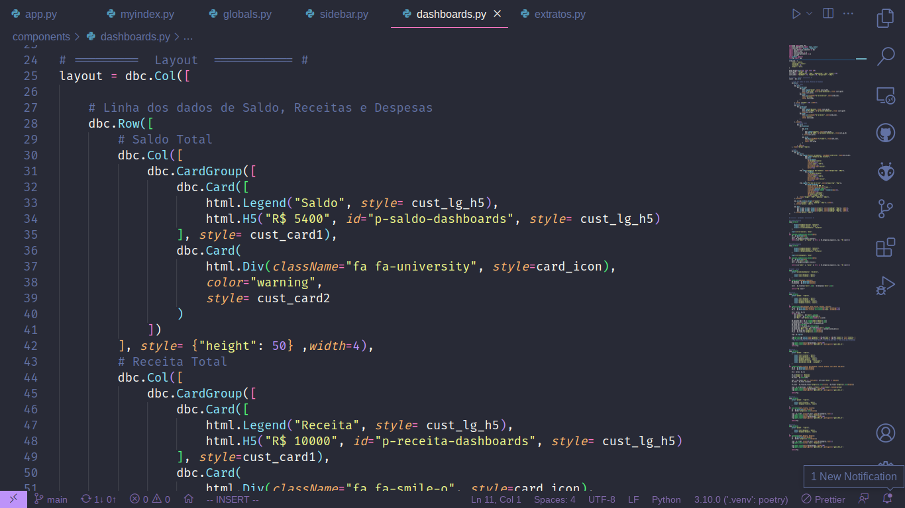

# Dashboard de Gerenciamento de Finanças Pessoais




## Objetivo

Desenvolver un deshboard para gerenciar as finanças pessoais


## Tecnologias

- Python
- Dash
- Plotly
- Pandas


## Como rodar a aplicação

- 1: Clone ou baixe os arquivos desse repositório
- 2: Instale as bibliotecas

```pip install pandas dash dash-bootstrap-components```

- 3: Acesse a pasta dos arquivos baixados e rode o seguinte comando

```python3 myindex.py```

- 4: Copie a url abaixo no seu browser favorito

```127.0.0.1:8051```

pronto, agora você tem o dashboard rodando em seu browser e pode testá-lo.
